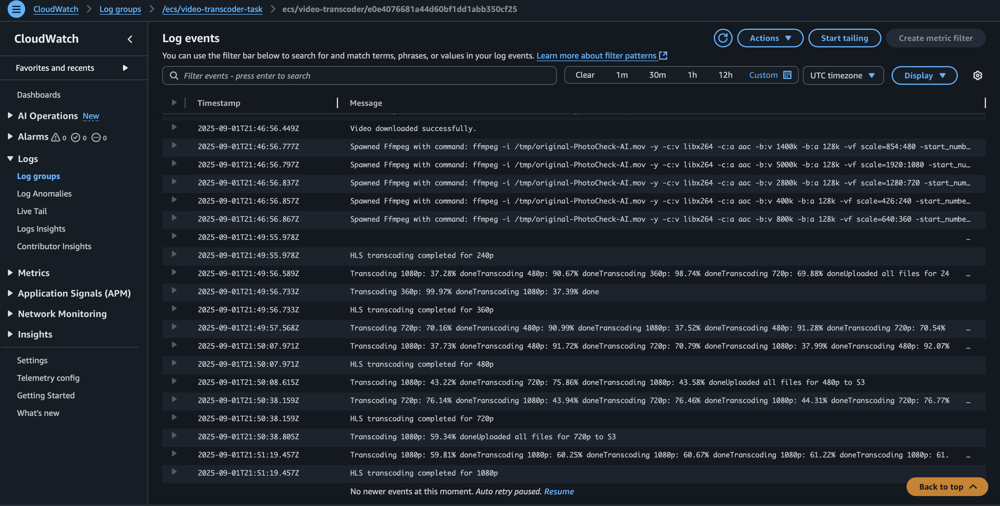

# Klipify - Scalable Video Transcoding Platform
A production-ready video transcoding platform that converts uploaded videos into HTTP Live Streaming (HLS) format with adaptive bitrate streaming. Built with modern cloud architecture using AWS services and microservices design.

## 🏗️ Architecture

The platform consists of three main microservices working together to provide a complete video transcoding solution.

## Application View


### 1. Frontend Application (Next.js)
- **Framework**: Next.js 15 with React 19 and TypeScript
- **UI**: Modern responsive design with Tailwind CSS
- **Video Player**: HLS.js for adaptive streaming playback
- **File Upload**: Direct S3 upload with presigned URLs and progress tracking
- **Real-time Updates**: Live status monitoring and progress updates

### 2. Video Consumer Service (Node.js)
- **Queue Processing**: Continuously polls AWS SQS for S3 upload events
- **Container Orchestration**: Automatically triggers ECS Fargate tasks
- **Event Management**: Handles S3 notifications and manages task lifecycle
- **Error Handling**: Robust error handling and message cleanup


### 3. Transcoding Container (Docker + FFmpeg)
- **Video Processing**: FFmpeg for multi-resolution transcoding
- **Output Formats**: Generates HLS segments with adaptive bitrate
- **Storage Management**: Uploads processed content to S3
- **Status Tracking**: Real-time progress updates via DynamoDB

## ✨ Key Features

- **🎥 Drag & Drop Upload**: Intuitive file upload with progress tracking
- **🔄 Auto Transcoding**: Converts to multiple resolutions (240p, 360p, 480p, 720p, 1080p)
- **📱 Adaptive Streaming**: HLS format with automatic quality adjustment based on bandwidth
- **⚡ Real-time Status**: Live transcoding progress updates and notifications
- **🎮 Custom Video Player**: Built-in player with manual quality selection
- **☁️ Cloud Native**: Fully serverless architecture with auto-scaling capabilities
- **🔒 Secure**: IAM roles, presigned URLs, and encrypted storage
- **📊 Monitoring**: Comprehensive logging and status tracking

## 🛠️ Tech Stack
### Frontend
- **Next.js 15**: React framework with App Router and server components
- **React 19**: Latest React with concurrent features and improved performance
- **TypeScript**: Full type safety across the application
- **Tailwind CSS**: Utility-first CSS framework for rapid UI development
- **HLS.js**: JavaScript library for HLS video streaming
- **AWS SDK v3**: Modern AWS SDK for S3 integration
- **Lucide Icons**: Beautiful and consistent icon library

### Backend Services
- **Node.js 18**: JavaScript runtime with ES modules support
- **TypeScript**: Type-safe backend development
- **AWS SDK v3**: Latest AWS SDK with improved performance
- **Docker**: Containerization for consistent deployments
- **FFmpeg**: Industry-standard video processing library

### Cloud Infrastructure
- **AWS S3**: Scalable object storage for raw and processed videos
- **AWS SQS**: Message queue for reliable event processing
- **AWS ECS Fargate**: Serverless container orchestration
- **AWS DynamoDB**: NoSQL database for real-time status tracking
- **AWS IAM**: Fine-grained security and access control

## 🚀 Quick Start Guide

### Prerequisites
- **Node.js 18+**: [Download here](https://nodejs.org/)
- **Docker Desktop**: [Download here](https://www.docker.com/products/docker-desktop/)
- **AWS Account**: With CLI configured ([Setup Guide](https://docs.aws.amazon.com/cli/latest/userguide/getting-started-install.html))
- **Git**: For version control

### 1. Clone Repository
```bash
git clone https://github.com/Debjyoti2004/Klipify.git
cd Klipify
```
## ☁️ AWS Infrastructure Setup (Disclaimer: The scripts will not work as-is because you need to add your own credentials and values.)
### Step 1: Create S3 Buckets Using CLI
```bash
# Create bucket for raw video uploads
aws s3 mb s3://klipify-raw-videos --region ap-south-1

# Create bucket for processed videos
aws s3 mb s3://klipify-processed-videos --region ap-south-1
# Enable public read access for processed videos
aws s3api put-bucket-policy --bucket klipify-processed-videos --policy '{
  "Version": "2012-10-17",
  "Statement": [
    {
      "Sid": "PublicReadGetObject",
      "Effect": "Allow",
      "Principal": "*",
      "Action": "s3:GetObject",
      "Resource": "arn:aws:s3:::klipify-processed-videos/*"
    }
  ]
}'

# Configure CORS for frontend access
aws s3api put-bucket-cors --bucket klipify-raw-videos --cors-configuration '{
  "CORSRules": [
    {
      "AllowedHeaders": ["*"],
      "AllowedMethods": ["GET", "POST", "PUT"],
      "AllowedOrigins": ["http://localhost:3000", "https://yourdomain.com"],
      "ExposeHeaders": ["ETag"],
      "MaxAgeSeconds": 3000
    }
  ]
}'
```

### Step 1: Create S3 Buckets Manually 
Click on the S3 and click on the Create S3 And Change the policy and cros


### Step 2: Create SQS Queue Using CLI
```bash
# Create SQS queue for S3 notifications
aws sqs create-queue \
  --queue-name video-processing-queue \
  --region ap-south-1

# Get queue URL and ARN for configuration
aws sqs get-queue-url --queue-name video-processing-queue
aws sqs get-queue-attributes \
  --queue-url https://sqs.ap-south-1.amazonaws.com/123456789012/video-processing-queue \
  --attribute-names QueueArn
```
### Step 2: Create SQS Queue Manually


### Step 3: Configure S3 Event Notifications Using CLI
```bash
# Create notification configuration
cat > s3-notification.json << EOF
{
  "QueueConfigurations": [
    {
      "Id": "VideoUploadNotification",
      "QueueArn": "arn:aws:sqs:ap-south-1:123456789012:video-processing-queue",
      "Events": ["s3:ObjectCreated:*"]
    }
  ]
}
EOF

# Apply notification configuration
aws s3api put-bucket-notification-configuration \
  --bucket mytube-raw-videos \
  --notification-configuration file://s3-notification.json
```
### Step 3: Configure S3 Event Notifications Manually


### Step 4: Create DynamoDB Table Using CLI
```bash
# Create table for transcoding status
aws dynamodb create-table \
  --table-name video-transcoding-status \
  --attribute-definitions AttributeName=jobId,AttributeType=S \
  --key-schema AttributeName=jobId,KeyType=HASH \
  --billing-mode PAY_PER_REQUEST \
  --region ap-south-1
```
### Step 4: Create DynamoDB Table Manually


### Step 5: Setup ECS Infrastructure Using CLI
```bash
# Create ECS cluster
aws ecs create-cluster \
  --cluster-name video-transcoding-cluster \
  --region ap-south-1

# Create ECR repository for container
aws ecr create-repository \
  --repository-name video-transcoder \
  --region ap-south-1

# Get ECR login token
aws ecr get-login-password --region ap-south-1 | docker login --username AWS --password-stdin 123456789012.dkr.ecr.ap-south-1.amazonaws.com

# Tag and push container
docker tag video-transcoder:latest 123456789012.dkr.ecr.ap-south-1.amazonaws.com/video-transcoder:latest
docker push 123456789012.dkr.ecr.ap-south-1.amazonaws.com/video-transcoder:latest
```
### Step 5: Setup ECS Infrastructure Manually

### Create ECR repository for container


### Step 6: Create IAM Roles and Policies Using CLI
#### ECS Task Execution Role
```bash
# Create task execution role
aws iam create-role \
  --role-name ecsTaskExecutionRole \
  --assume-role-policy-document '{
    "Version": "2012-10-17",
    "Statement": [
      {
        "Effect": "Allow",
        "Principal": {
          "Service": "ecs-tasks.amazonaws.com"
        },
        "Action": "sts:AssumeRole"
      }
    ]
  }'

# Attach AWS managed policy
aws iam attach-role-policy \
  --role-name ecsTaskExecutionRole \
  --policy-arn arn:aws:iam::aws:policy/service-role/AmazonECSTaskExecutionRolePolicy
```
### Step 6: Create IAM Roles and Policies Manually
1. Open the IAM Console.

2. Click on Create Role.

3. Enter a suitable name for the role.

4. Attach the required permissions/policies based on your project needs (⚠️ not recommended to give full admin access to users).

### Step 7: Create ECS Task Definition Using CLI
```bash
cat > task-definition.json << EOF
{
  "family": "video-transcoder-task",
  "networkMode": "awsvpc",
  "requiresCompatibilities": ["FARGATE"],
  "cpu": "1024",
  "memory": "2048",
  "executionRoleArn": "arn:aws:iam::123456789012:role/ecsTaskExecutionRole",
  "taskRoleArn": "arn:aws:iam::123456789012:role/videoTranscoderTaskRole",
  "containerDefinitions": [
    {
      "name": "video-transcoder",
      "image": "123456789012.dkr.ecr.ap-south-1.amazonaws.com/video-transcoder:latest",
      "logConfiguration": {
        "logDriver": "awslogs",
        "options": {
          "awslogs-group": "/ecs/video-transcoder",
          "awslogs-region": "ap-south-1",
          "awslogs-stream-prefix": "ecs",
          "awslogs-create-group": "true"
        }
      },
      "environment": [
        {
          "name": "PRODUCTION_BUCKET",
          "value": "Klipify-processed-videos"
        },
        {
          "name": "DYNAMODB_TABLE",
          "value": "video-transcoding-status"
        }
      ]
    }
  ]
}
EOF
# Register task definition
aws ecs register-task-definition --cli-input-json file://task-definition.json
```
### Step 7: Create ECS Task Definition Manually


## 🔄 Video Processing Workflow
### Detailed Process Flow
1. **📤 Video Upload**
   - User selects video file through web interface
   - Frontend requests presigned URL from S3
   - File uploaded directly to S3 raw bucket with progress tracking
   - Upload metadata stored locally

2. **📨 Event Notification**
   - S3 triggers notification to SQS queue upon successful upload
   - Message contains bucket name, object key, and event metadata
   - Queue ensures reliable message delivery with retry logic

3. **⚡ Event Processing**
   - Consumer service polls SQS queue every 20 seconds
   - Receives and validates upload notification message
   - Filters out test events and invalid messages

4. **🚀 Container Orchestration**
   - Consumer launches ECS Fargate task with video metadata
   - Task receives environment variables for processing
   - Container spins up with allocated CPU and memory resources
5. **🎬 Video Transcoding**
   - Container downloads original video from S3
   - FFmpeg processes video into multiple resolutions:
     - **240p** (426x240) - 400k bitrate - Mobile/Low bandwidth
     - **360p** (640x360) - 800k bitrate - Standard mobile
     - **480p** (854x480) - 1400k bitrate - Standard definition
     - **720p** (1280x720) - 2800k bitrate - High definition
     - **1080p** (1920x1080) - 5000k bitrate - Full HD

6. **📦 HLS Segmentation**
   - Each resolution segmented into 10-second chunks
   - Individual .m3u8 playlists created for each quality
   - Master playlist created linking all quality levels
   - Segments optimized for streaming delivery

7. **☁️ Content Upload**
   - All HLS segments uploaded to processed S3 bucket
   - Playlists and metadata files uploaded
   - Files organized by quality level and video ID
   - Public read access configured for streaming
8. **📊 Status Updates**
   - Progress tracked in DynamoDB throughout entire process
   - Real-time status updates for each transcoding step
   - Error handling and retry logic for failed operations
   - Completion notification when video is ready

9. **🎥 Video Streaming**
   - Client requests master playlist from processed bucket
   - HLS.js player automatically selects optimal quality
   - Adaptive streaming adjusts quality based on bandwidth
   - Seamless quality switching during playback

### 2. Frontend Setup   
```bash
cd frontend
```
```bash
# Setup environment variables
# Only these variables needed now:
AWS_ACCESS_KEY_ID=<Your AWS_ACCESS_KEY_ID>
AWS_SECRET_ACCESS_KEY=<Your AWS_SECRET_ACCESS_KEY>
AWS_REGION=<Your AWS_REGION>
AWS_S3_RAW_BUCKET=<Your Row S3 BUCKET NAME>
AWS_S3_PROCESSED_BUCKET=<Your Prod S3 BUCKET NAME>
NEXTAUTH_SECRET=kK7ZeNV4NUwkZHN1q9bJG4RPozW19a0gn88IaGhHr84=
```

```bash
# Install dependencies
npm install
```

```bash
# Run the Application 
npm run dev
```
### 3. Consumer Service Setup

```bash
cd ../consumer
```

```bash
# Setup environment variables
AWS_ACCESS_KEY_ID=<Your AWS_ACCESS_KEY_ID>
AWS_SECRET_ACCESS_KEY=<Your AWS_SECRET_ACCESS_KEY>
AWS_REGION=<Your AWS_REGION>
AWS_S3_RAW_BUCKET=<Your Row S3 BUCKET NAME>
AWS_S3_PROCESSED_BUCKET=<Your Prod S3 BUCKET NAME>
NEXTAUTH_SECRET=kK7ZeNV4NUwkZHN1q9bJG4RPozW19a0gn88IaGhHr84=
```

```bash
# Install dependencies
npm install
```
```bash
# Setup environment variables
AWS_ACCESS_KEY_ID= <Your AWS_ACCESS_KEY_ID>
AWS_SECRET_ACCESS_KEY= <Your AWS_SECRET_ACCESS_KEY>
QUEUE_URL= <Your SQS QUEUE_URL>
CLUSTER_NAME= <Your CLUSTER_NAME>
TASK_DEFINITION= <Your TASK_DEFINITION (ARN)>
CONTAINER_NAME= <Your CONTAINER_NAME>
```
```bash
# Run the Application 
npm run dev
```

### 4. Container Setup

```bash
cd ../container
```
Then follow the instructions provided by ECR.


```bash
PRODUCTION_BUCKET= <Your PRODUCTION_BUCKET NAME>
DYNAMODB_TABLE= <Your DYNAMODB_TABLE NAME>
# You need to include this content while creating the Task Definition.
```

### CloudWatch Logs

### After video transcoding, use Docker to push everything to the S3 bucket.
